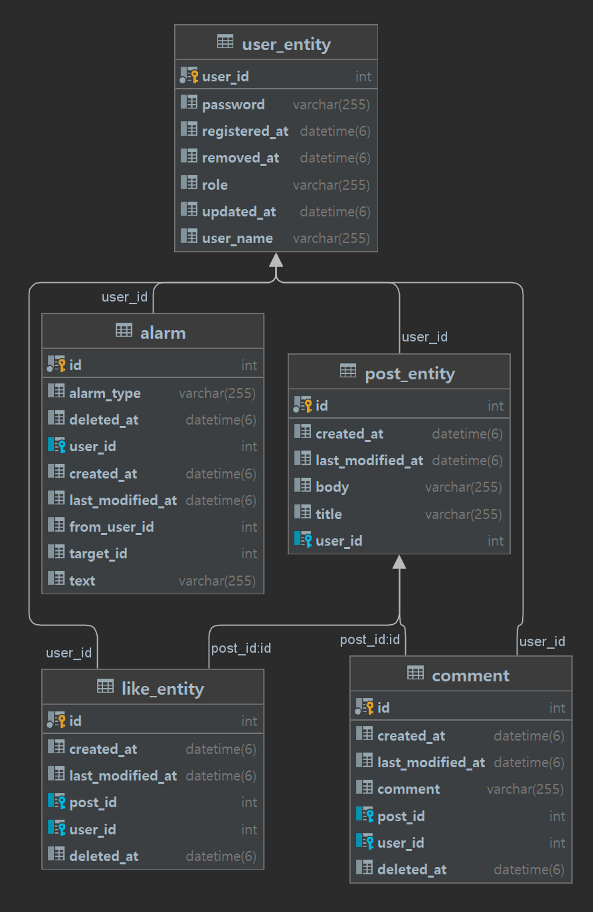

# MutsaSNS
SpringBoot+Jwt+JPA를 이용한 SNS

## 개발 환경
- **Java 11**
- **Framework** : Springboot 2.7.5
- **Build** : Gradle 7.5.1
- **DB** : MySQL 8.0
- **Sever** : AWS EC2
- 그 외 라이프러리 : SpringBoot Web, MySQL, Spring Data JPA, Lombok, Spring Security, JWT, Swagger

## 미션 요구사항 분석 & 체크리스트
### 기능목록
**필수**
- [x] AWS EC2에 Docker로 배포
- [x] Swagger
- [x] Gitlab CI & Crontab CD
- [x] 회원가입
- [x] 로그인
- [x] 포스트 작성, 수정, 조회, 삭제
- [x] 포스트 리스트
- [x] 댓글
- [x] 좋아요
- [x] 마이피드
- [x] 알림
- [x] Swagger ApiOperation

**도전**
- [ ] 화면 UI 개발
- [x] ADMIN 회원이 일반 회원을 ADMIN으로 승격 시키는 기능
- [x] ADMIN 회원이 로그인 시 자신이 쓴 글이 아닌 글을 수정, 삭제 기능

## URL
http://ec2-43-200-169-22.ap-northeast-2.compute.amazonaws.com:8080/swagger-ui/

## ERD

## Endpoint
- `Get /api/v1/hello`<br>

### 사용자
- 회원가입 `Post /api/v1/users/join`<br>
  **Request Body**
  ```Json
  {
    "password": "string",
    "userName": "string"
  }
  ```
  **Response Body**
  ```Json
  {
    "result": {
      "userId": 0,
      "userName": "string"
    },
    "resultCode": "string"
  }
  ```

- 로그인 `Post /api/v1/users/login`<br>
  **Request Body**
  ```Json
  {
    "password": "string",
    "userName": "string"
  }
  ```
  **Response Body**
  ```Json
  {
    "result": {
      "jwt": "string"
    },
    "resultCode": "string"
  }
  ```
- 권한 부여 `Post /api/v1/users/{id}/role/change`<br>
  **Request Body**
  ```Json
  {
    "role" : "string"
  }
  ```
  **Response Body**
  ```Json
  {
    "result": {
      "role": "ADMIN" | "USER",
      "userId": 0,
      "userName": "string"
    },
    "resultCode": "string"
  }
  ```

### 포스트
- 포스트 작성 `Post /api/v1/posts`<br>
  **Request Body**
  ```Json
  {
    "body": "string",
    "title": "string"
  }
  ```
  **Response Body**
  ```Json
  {
    "result": {
      "message": "string",
      "postId": 0
    },
    "resultCode": "string"
  }
  ```

- 포스트 리스트 조회 `Get /api/v1/posts`<br>
  **Response Body**
  ```Json
  {
    "result": {
      "content": [
        {
          "body": "string",
          "createdAt": "yyyy/mm/dd hh:mm:ss",
          "id": 0,
          "lastModifiedAt": "yyyy/mm/dd hh:mm:ss",
          "title": "string",
          "userName": "string"
        }
      ],
      "empty": true,
      "first": true,
      "last": true,
      "number": 0,
      "numberOfElements": 0,
      "pageable": {
        "offset": 0,
        "pageNumber": 0,
        "pageSize": 0,
        "paged": true,
        "sort": {
          "empty": true,
          "sorted": true,
          "unsorted": true
        },
        "unpaged": true
      },
      "size": 0,
      "sort": {
        "empty": true,
        "sorted": true,
        "unsorted": true
      },
      "totalElements": 0,
      "totalPages": 0
    },
    "resultCode": "string"
  }
  ```

- 포스트 상세 조회 `Get /api/v1/posts/{postId}`<br>
  **Response Body**
  ```Json
  {
    "result": {
      "body": "string",
      "createdAt": "yyyy/mm/dd hh:mm:ss",
      "id": 0,
      "lastModifiedAt": "yyyy/mm/dd hh:mm:ss",
      "title": "string",
      "userName": "string"
    },
    "resultCode": "string"
  }
  ```

- 포스트 수정 `Put /api/v1/posts/{id}`<br>
  **Request Body**
  ```Json
  {
    "body": "string",
    "title": "string"
  }
  ```
  **Response Body**
  ```Json
  {
    "result": {
      "message": "string",
      "postId": 0
    },
    "resultCode": "string"
  }
  ```
- 포스트 삭제 `Delete /api/v1/posts/{id}`<br>
  **Response Body**
  ```Json
  {
  "result": {
    "message": "string",
    "postId": 0
  },
  "resultCode": "string"
  }
  ```
### 댓글
- 댓글 조회 `GET /api/v1/posts/{postId}/comments`<br>
  **Response Body**
  ```Json
  {
  "result": {
    "content": [
      {
        "comment": "string",
        "createdAt": "yyyy/mm/dd hh:mm:ss",
        "id": 0,
        "lastModifiedAt": "yyyy/mm/dd hh:mm:ss",
        "postId": 0,
        "userName": "string"
      }
    ],
    "empty": true,
    "first": true,
    "last": true,
    "number": 0,
    "numberOfElements": 0,
    "pageable": {
      "offset": 0,
      "pageNumber": 0,
      "pageSize": 0,
      "paged": true,
      "sort": {
        "empty": true,
        "sorted": true,
        "unsorted": true
      },
      "unpaged": true
    },
    "size": 0,
    "sort": {
      "empty": true,
      "sorted": true,
      "unsorted": true
    },
    "totalElements": 0,
    "totalPages": 0
    },
    "resultCode": "string"
  }
  ```
- 댓글 작성 `POST /api/v1/posts/{postsId}/comments/{id}`<br>
  **Request Body**
  ```Json
  { 
    "comment" : "string"
  }
  ```
  **Response Body**
  ```Json
  {
    "resultCode": "string",
    "result": {
      "id": 0,
      "comment": "string",
      "userName": "string",
      "postId": 0,
      "createdAt": "yyyy/mm/dd hh:mm:ss",
      "lastModifiedAt": "yyyy/mm/dd hh:mm:ss"
    }
  }
  ```
- 댓글 수정 `PUT /api/v1/posts/{postID}/comments`<br>
  **Request Body**
  ```Json
  { 
    "comment" : "string"
  }
  ```
  **Response Body**
  ```Json
  {
    "resultCode": "string",
    "result": {
      "id": 0,
      "comment": "string",
      "userName": "string",
      "postId": 0,
      "createdAt": "yyyy/mm/dd hh:mm:ss",
      "lastModifiedAt": "yyyy/mm/dd hh:mm:ss"
    }
  }
  ```
- 댓글 삭제 `DELETE /posts/{postsId}/comments/{id}`<br>
  **Response Body**
  ```Json
  {
    "resultCode": "string",
    "result":{
      "message": "string",
      "id": 0
    }
  }
  ```
### 좋아요
- 좋아요 누르기 `POST /api/v1/posts/{postId}/likes`<br>
  **Response Body**
  ```Json
  {
    "resultCode" : "string",
    "resut" : "string"
  }
  ```
- 좋아요 조회 `GET /api/v1/posts/{postId}/likes`<br>
  **Response Body**
  ```Json
  {
    "resultCode" : "string",
    "resut" : 0
  }
  ```
### 마이피드
- 조회 기능 `GET /api/v1/posts/my`<br>
  **Response Body**
  ```Json
  {
    "resultCode": "string",
    "result": {
      "content": [
        {
          "alarmType": "NEW_COMMENT_ON_POST",
          "createdAt": "yyyy/dd/mm hh:mm:ss",
          "fromUserId": 0,
          "id": 0,
          "targetId": 0,
          "text": "string"
        }
      ],
      "empty": true,
      "first": true,
      "last": true,
      "number": 0,
      "numberOfElements": 0,
      "pageable": {
        "offset": 0,
        "pageNumber": 0,
        "pageSize": 0,
        "paged": true,
        "sort": {
          "empty": true,
          "sorted": true,
          "unsorted": true
        },
        "unpaged": true
      },
      "size": 0,
      "sort": {
        "empty": true,
        "sorted": true,
        "unsorted": true
      },
      "totalElements": 0,
      "totalPages": 0
    }
  }
  ```

> ### 1주차 미션 요약
[신경쓴 부분]
Security를 적용하는 부분을 신경을 많이 썼다. 인증과 인가를 구현하기는 했지만 토큰이 없거나 잘못되었을 때 ErrorCode를 Response로 전달하는 방법에 대해서 찾아보고 적용하는 부분에서 많은 시간을 썼다. 
처음 CI/CD를 구현할 때

[개선할 점]
하드 코딩된 값을 상수화하여 사용하고 Post에서 해당 포스트가 존재하는 찾는 코드가 중복되는데 이 부분을 분리하여 재사용하도록 수정하면 코드가 더 깔끔할 것 같다. 

[궁금한 점]
- 포스트 리스트를 조회할 때 정렬이 되었는지 확인하는 테스트 코드를 어떻게 작생하야하는가
- CI/CD를 브랜치에서도 적용하고 싶다

> ### 2주차 미션 요약
[신경쓴 부분]
- Service에서 중복해서 사용되는 기능들은 메서드로 분리해서 사용하도록 했다. 
- 엔티티를 수정해야할 때 Setter 방식 대신 엔티티 내부에서 수정하도록 구현했다.

[개선할 점]
- 댓글, 알람 페이징 조회 테스트 시 정렬이 안되는데 정렬도 테스트가 되도록 코드 수정이 필요하다.
- 테스트 코드 Fixture